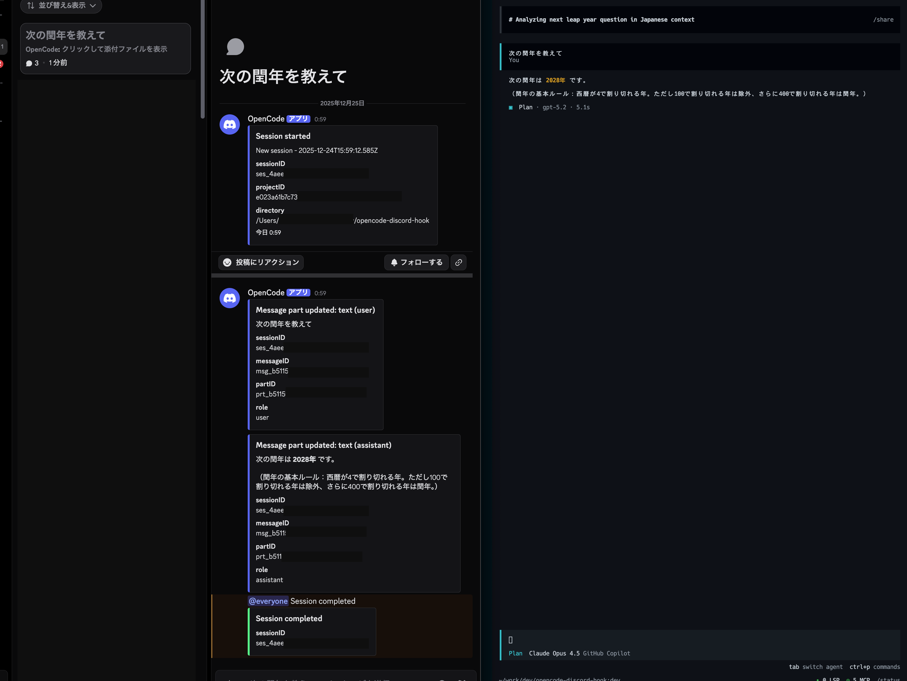

# opencode-discord-notify

[](LICENSE)
[](https://www.npmjs.com/package/opencode-discord-notify)
[](https://www.npmjs.com/package/opencode-discord-notify)
[](https://www.npmjs.com/package/opencode-discord-notify)


<p align="center">
  
</p>

**Get real-time OpenCode notifications directly in your Discord server.**

This plugin creates organized threads in Discord Forum channels for each OpenCode session, keeping you updated on session events, permissions, todos, and conversations.

## Features

- **Session tracking**: Automatic thread creation for each session
- **Real-time updates**: Permission requests, session completion, errors
- **Todo checklists**: Visual todo updates with status icons
- **Smart notifications**: User messages sent immediately, agent responses when finalized
- **Mention support**: Optional `@everyone` or `@here` mentions for important events
- **Fallback webhooks**: Send critical mentions to text channels for guaranteed delivery

## Quick Start

### 1. Install the plugin

Add to your `opencode.json` or `opencode.jsonc`:

```jsonc
{
  "plugin": ["opencode-discord-notify@latest"],
}
```

Restart OpenCode.

### 2. Create a Discord webhook

1. Open your Discord server settings
2. Go to a **Forum channel** (recommended) or text channel
3. Navigate to **Integrations** → **Webhooks**
4. Click **New Webhook** and copy the webhook URL

### 3. Set the webhook URL

Set the environment variable:

```bash
export DISCORD_WEBHOOK_URL="https://discord.com/api/webhooks/..."
```

**That's it!** Start using OpenCode and watch notifications appear in Discord.

## Configuration

### Environment Variables

| Variable                                | Required | Default | Description                                                                                                          |
| --------------------------------------- | -------- | ------- | -------------------------------------------------------------------------------------------------------------------- |
| `DISCORD_WEBHOOK_URL`                   | ✅ Yes   | -       | Discord webhook URL. Plugin is disabled if not set.                                                                  |
| `DISCORD_WEBHOOK_USERNAME`              | ❌ No    | -       | Custom username for webhook posts                                                                                    |
| `DISCORD_WEBHOOK_AVATAR_URL`            | ❌ No    | -       | Custom avatar URL for webhook posts                                                                                  |
| `DISCORD_WEBHOOK_COMPLETE_MENTION`      | ❌ No    | -       | Add `@everyone` or `@here` to session completion/error notifications                                                 |
| `DISCORD_WEBHOOK_PERMISSION_MENTION`    | ❌ No    | -       | Add `@everyone` or `@here` to permission request notifications                                                       |
| `DISCORD_WEBHOOK_EXCLUDE_INPUT_CONTEXT` | ❌ No    | `1`     | Set to `0` to include file context in notifications                                                                  |
| `DISCORD_WEBHOOK_SHOW_ERROR_ALERT`      | ❌ No    | `1`     | Set to `0` to disable error toast notifications                                                                      |
| `DISCORD_SEND_PARAMS`                   | ❌ No    | -       | Comma-separated embed fields: `sessionID,permissionID,type,pattern,messageID,callID,partID,role,directory,projectID` |
| `DISCORD_WEBHOOK_FALLBACK_URL`          | ❌ No    | -       | Fallback webhook URL for text channel (sends mentions here too for guaranteed ping)                                  |

### Example Configuration

**Basic usage:**

```bash
export DISCORD_WEBHOOK_URL="https://discord.com/api/webhooks/your-webhook-url"
```

**With mentions and fallback:**

```bash
export DISCORD_WEBHOOK_URL="https://discord.com/api/webhooks/forum-webhook-url"
export DISCORD_WEBHOOK_FALLBACK_URL="https://discord.com/api/webhooks/text-channel-webhook-url"
export DISCORD_WEBHOOK_COMPLETE_MENTION="@everyone"
export DISCORD_WEBHOOK_PERMISSION_MENTION="@here"
```

**With custom appearance:**

```bash
export DISCORD_WEBHOOK_URL="https://discord.com/api/webhooks/your-webhook-url"
export DISCORD_WEBHOOK_USERNAME="OpenCode Bot"
export DISCORD_WEBHOOK_AVATAR_URL="https://example.com/avatar.png"
```

## Advanced

<details>
<summary><strong>Event Handling Details</strong></summary>

### Supported Events

- **`session.created`**: Queues session start notification (sent when thread info is available)
- **`permission.updated`**: Posts permission request immediately
- **`session.idle`**: Posts session completion notification
- **`session.error`**: Posts error notification (skipped if `sessionID` missing)
- **`todo.updated`**: Posts checklist with `[▶]` (in progress), `[✓]` (completed); excludes cancelled
- **`message.updated`**: Tracked internally for role detection (not posted)
- **`message.part.updated`**:
  - `text`: User messages posted immediately; agent messages posted when finalized
  - `tool`: Not posted
  - `reasoning`: Not posted

</details>

<details>
<summary><strong>Thread Creation Behavior</strong></summary>

### Thread Naming Priority

Thread names use the first available option (max 100 chars):

1. First user text message
2. Session title
3. `session <sessionID>`
4. `untitled`

### Forum vs Text Channel

- **Forum channels**: Creates a new thread per session using `thread_name`
- **Text channels**: Posts directly (threads not supported)
- **Fallback**: If thread creation fails, falls back to direct channel posting

</details>

<details>
<summary><strong>Mention & Fallback Behavior</strong></summary>

### Why Fallback Webhooks?

Discord Forum webhooks **do not trigger pings** for `@everyone` or `@here` mentions. They appear as plain text.

To ensure you get notified:

1. Set `DISCORD_WEBHOOK_URL` to your Forum webhook (for organized threads)
2. Set `DISCORD_WEBHOOK_FALLBACK_URL` to a text channel webhook (for actual pings)
3. Messages with mentions will be sent to **both** webhooks

### Fallback Message Format

Fallback messages always include:

- `sessionID` field
- `thread title` field (same as Forum thread name)

This provides context when viewing notifications in the text channel.

</details>

<details>
<summary><strong>Error Handling & Rate Limits</strong></summary>

### HTTP 429 (Rate Limit)

- Waits for `retry_after` seconds (or ~10s if not provided)
- Retries once
- Shows warning toast if still fails

### Failed Requests

- Shows OpenCode TUI toast notification (controlled by `DISCORD_WEBHOOK_SHOW_ERROR_ALERT`)
- Logs error details for debugging

</details>

<details>
<summary><strong>Field Customization</strong></summary>

### `DISCORD_SEND_PARAMS`

Controls which metadata fields appear in embeds.

**Allowed keys:**

- `sessionID`, `permissionID`, `type`, `pattern`, `messageID`, `callID`, `partID`, `role`, `directory`, `projectID`

**Default behavior (unset/empty):**

- No fields sent (cleaner embeds)

**To send all fields:**

```bash
export DISCORD_SEND_PARAMS="sessionID,permissionID,type,pattern,messageID,callID,partID,role,directory,projectID"
```

**Note:** `session.created` always includes `sessionID` regardless of this setting.

</details>

## Development

### Setup

```bash
npm install
```

### Format Code

```bash
npx prettier . --write
```

### Plugin Source

Main implementation: `src/index.ts`

## Roadmap

- [ ] Support multiple webhooks for routing by event type
- [ ] Customizable notification templates
- [ ] Configuration file support (e.g., `opencode-discord-notify.config.json`)
- [ ] Enhanced rate limit handling (smarter retry logic, message queuing)
- [x] CI/CD (automated linting, formatting, testing)

## Contributing

PRs and issues are welcome! Please feel free to:

- Report bugs
- Request features
- Submit improvements
- Share feedback

---

**License:** MIT
